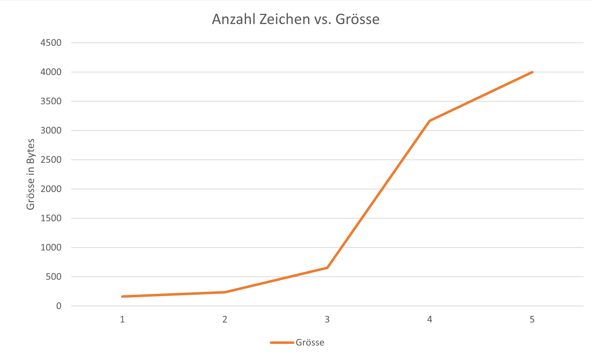

# Verlustlose Komprimierung
## RLC/E-Verfahren

#### RL-Code:
010100011110010010010010010010010010010110010110010010010010010010010010001
- 8 Pixel 
- Beginnt Links oben mit Weiss
- Grösste Wiederholung = 7 mal
    - 3 Bits
- 75 Bits

75 / 3 = 25 Farbwechsel

#### Visualisiertd
010 100 011 110 010 010 010 010 010 010 010 010 010 110 010 110 010 010 010 010 010 010 010 010 001
#### Encoded
010 2
100 4
011 3
110 6

010 2
010 2
010 2
010 2

010 2
010 2
010 2
010 2

010 2
110 6

010 2
110 6

010 2
010 2
010 2
010 2

010 2
010 2
010 2
010 2

001 1

#### Bild
0 0|1 1 1 1|0 0
0|1 1 1 1 1 1|0
0|1 1|0 0|1 1|0
0|1 1|0 0|1 1|0
0|1 1 1 1 1 1|0
0|1 1 1 1 1 1|0
0|1 1|0 0|1 1|0
0|1 1|0 0|1 1|0

## LZW-Verfahren
### Encoding
«ANANAS»

A   | AN  256
N   | NA  257
256 | ANA 258
A   | AS  259
S   | - 

AN<256>AS

### Decoding
ERDBE<256>KL<260>

E  | -
R  | ER 256
D  | RD 257
B  | DB 258
E  | BE 259
ER | EE 260
K  | ERK 261
L  | KL 262
EE | LE 263

ERDBEERKLEE

## ZIP-Komprimierung

### 10 - 100'000
Random Text via: https://www.blindtextgenerator.com/lorem-ipsum
 Anzahl Zeichen - Bytes unkomprimiert - Bytes komprimiert
1. 10 -      10 Bytes -   164 Bytes
2. 100 -     100 Bytes -   234 Bytes
3. 1'000 -   1'000 Bytes -   655 Bytes
4. 10'000 -  10'000 Bytes - 3'167 Bytes
5. 100'000 - 100'000 Bytes - 3'997 Bytes

### pures A
Grösse txt: 100'000 Bytes
Grösse zip: 285 Bytes

-> Grosse Repetition kann sehr gut komprimiert werden ohne Verlust

### JPG
auflösung - Bytes JPG - Bytes ZIP
1. High - 257 Bytes - 236 Bytes
1. Low  - 24 Bytes - 17 Bytes

-> Zip kann hier weniger Komprimieren, da vieles schon komprimiert wurde

## BWT (Burrows-Wheeler-Transformation)

### ANANAS
#### Encoding

ANANAS

1. ANANAS | 1. | ANANAS
2. SANANA | 3. | ASANAN
3. ASANAN | 5. | ANASAN
4. NASANA | 4. | NASANA
5. ANASAN | 6. | NANASA
6. NANASA | 2. | SANANA

-> SNNAAA 1
 / S 2N 3A 1

#### Decoding
CHAR  S N N A A A
POS   1 2 3 4 5 6

NEXT  4 5 6 2 3 1
CHAR  A A A N N S
POS   1 2 3 4 5 6

NEXT  4 2 5 3 6 1
CHAR  A N A N A S
POS   1 4 2 5 3 6

### IICRTGH6

CHAR  I I C R T G H
POS   1 2 3 4 5 6 7

NEXT  3 6 7 1 2 4 5
CHAR  C G H I I R T
POS   1 2 3 4 5 6 7

NEXT  4 1 3 7 5 2 6
CHAR  R I C H T I G
POS   6 4 1 3 7 6 2