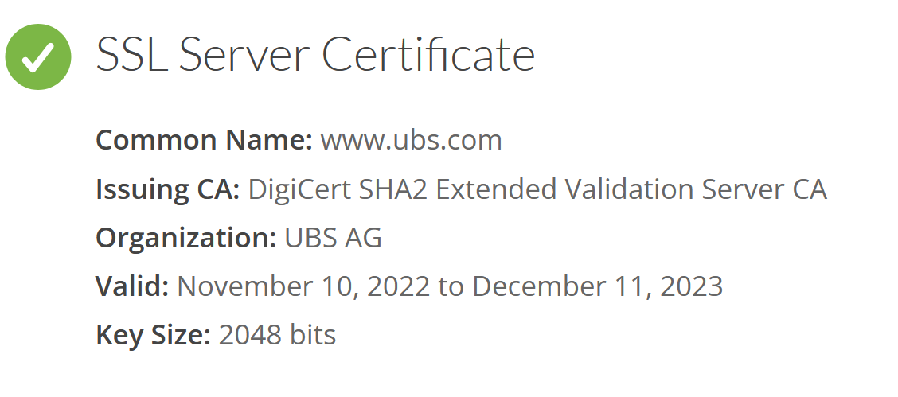
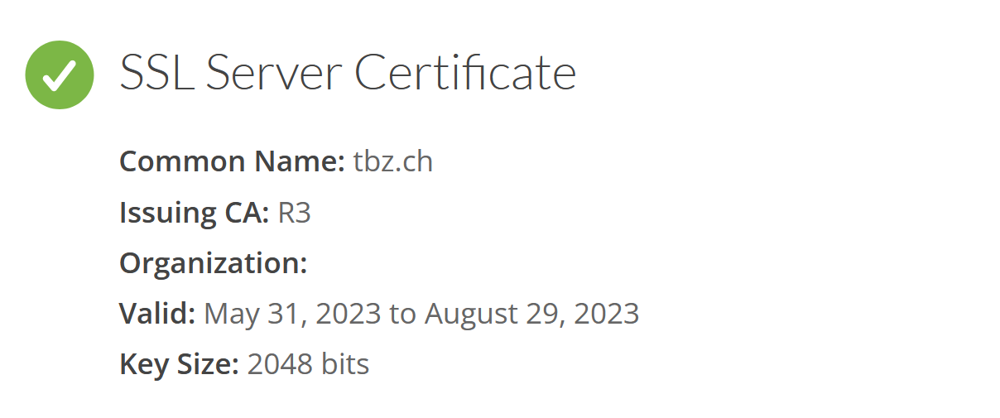
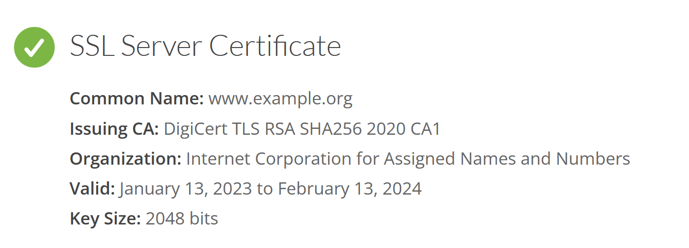
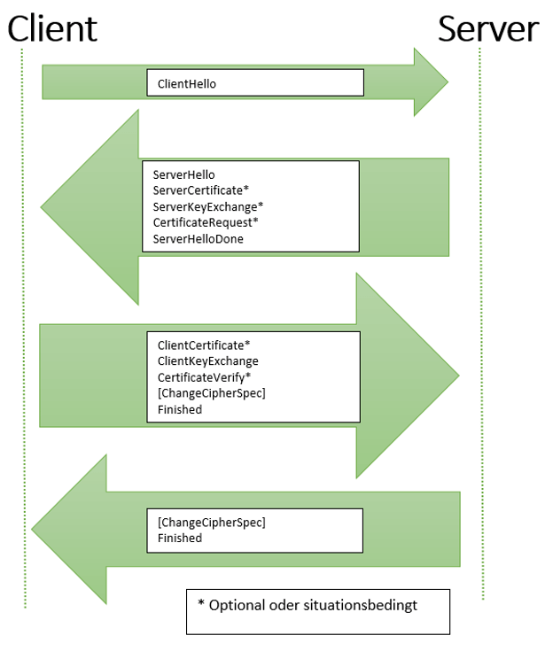

# Wiederholung
## Asymmetrisch vs. Symmetrisch
### Asymmetrisch:
+Einfacherer Schlüsseltausch
-langsam
+ein schlüssel pro person
!ausgeben als jemand anderen

### Symmetrisch:
+schnell
-schlüsseltausch
-viele Schlüssel

# Aufgaben
## Public Key Infrastruktur
### Wie kann ich den Public-Key verifizieren?
Der Public-Key hat ein Zertifikat, dass es z.B. von Bob ist und nicht von Mallery.
### Was versteht man unter Public Key Infrastruktur?
P(ublic)K(ey)I(nfrastructur) basiert auf Vertrauen, um Zertifikate zu validieren und bestätigen.
### Was bedeutet Certification-Authority (CA) und was Trust-Center (TC)?
CA's oder TC's geben sichere, vertraubare Zertifikate heraus.
### Finden sie heraus, wer das Zertifikat für die Bankwebseite www.ubs.com ausgestellt hat und wie lange es gültig ist. (https://www.geocerts.com/ssl-checker)

#### Wiederholen sie das ganze für die Schulwebseite www.tbz.ch

#### Und zulezt noch für die Webseite www.example.com

## Internet und Zertifikate
### Erstellen sie eine virtuelle Linux-Maschine mit z.B. VirtualBox und Ubuntu. Richten sie nun auf ihrem WIN-PC eine Remoteverbindung via ssh zu ihrem Linux-PC ein. Überprüfen sie die Verbindung. Wäre auch eine graphische Anbindung möglich?
Für eine graphische Anbindung bräuchte man spezielle Programme. SSL unterstützt dies nicht.
### Öffnen sie die beiden folgenden Webseiten und achten sie auf die Unterschiede in der Webadresszeile. Was stellen sie bezüglich Protokoll und Zertifikat fest?
- https://juergarnold.ch
- https://www.zkb.ch
Das Zertifikat ist von anderen CA's bereit gestellt worden.
### Wenn sie sich mit Zertifikaten befassen, fallen ihnen früher oder später folgende Anbieter bzw. Webseiten auf:
http://www.cacert.org
https://letsencrypt.org/de
Was genau wird hier zu welchen Konditionen angeboten?

Der erste link benutzt keine TLS, weshalb er kein Zertifikat besitzt.

### Folgende TLS Zertifikatsarten werden unterschieden:
Domain Validated
Organization Validated
Extended Validation
Sie möchten einen Webshop betreiben, wo mit Kreditkarte bezahlt werden kann. Welcher Zertifikatstyp ist der richtige?

Eine "erststufige" Domain Validation wäre zu unsicher und ein Angreifer könnte einfach die Seite nachahnen.
Eine "zweitstufige" Organisazion Validation ist sicherer, und liefert zugleich eine validation der Betreiber der Webseite. Doch dies Merkt man auf erstem Blick gar nicht.

### Was ist der Unterschied zwischen OpenPGP und X.509?
OpenPGP wird oft bei der Mail-Verschlüsslung eingesetzt, während X.509 eine Gratis Zertifikats-Art von CaCert ist.

### Erklären sie den Aufruf einer sicheren Webseite. (HTTPS)
Der Klient fragt beim Server nach. Der Server gibt sein Zertifikat zurück, um sich zu validieren. Der Klient validiert darauf hin das Zertifikat. Sobald das Zertifikat verifiziert wurde, wird sich auf ein Synchroner Schlüssel mithilfe von Asynchronen Schlüssel geeinigt, und die Webseite wird geladen.
Simple Illustration:

### Was bedeutet S/MIME?
Secure / Multipurpose Internet Mail Extensions

### Aus gesetzlichen Gründen sind sie verpflichtet, den gesamten geschäftlichen EMail-Verkehr zu archivieren, auch den verschlüsselten. Was ist das Problem dabei und wie könnte man dies lösen?

