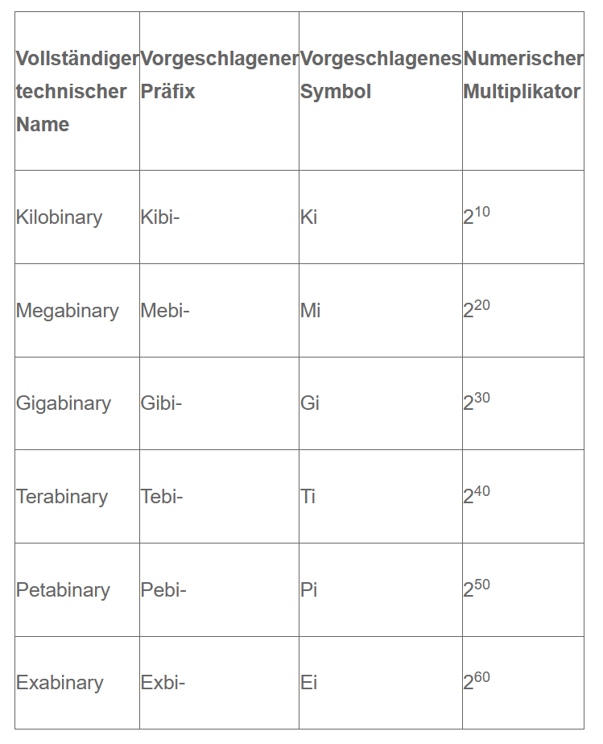

# Lernjournal vom <* Date Here *>

## Repetition

### Kahoot Randnotizen
kibi = kibibyte = 1.024 Byte

### Dateiendung

Windows liest aus der Dateiendung, welche Datei es ist und encoded sie Entsprechend.
In Mac gibt es einen ganzen extra Folder.

### Schachbrett Problem

int  : 32bit
long : 64bit

float  : 32bit
double : 64bit

Fliesskommazahl:
    double 64 bit
    x.xxxxxx E xxx
    -> Wissenschaftliche Notation
        - Ungenau
        - Nur representation der Zahl

### Zahlensystene To Know

10 Zehner
 2 Binär / Dual
 8 Oktal
16 Hex

## Reflexion

Heute konnten wir gut einsteigen in das Modul. Wir schauten uns verschiedene Zahlensysteme an und wendeten diese auch in Aufgaben anwenden. Die meisten Aufgaben wurden jedoch sehr schnell sehr repetiv, weshalb ich die meisten Überspringte und spezifisch die Aufgabe mit dem *switzerland.bin* erledigte, welche auch sehr viel Praktik einband. Diese machte auch sehr spass zu lösen.
